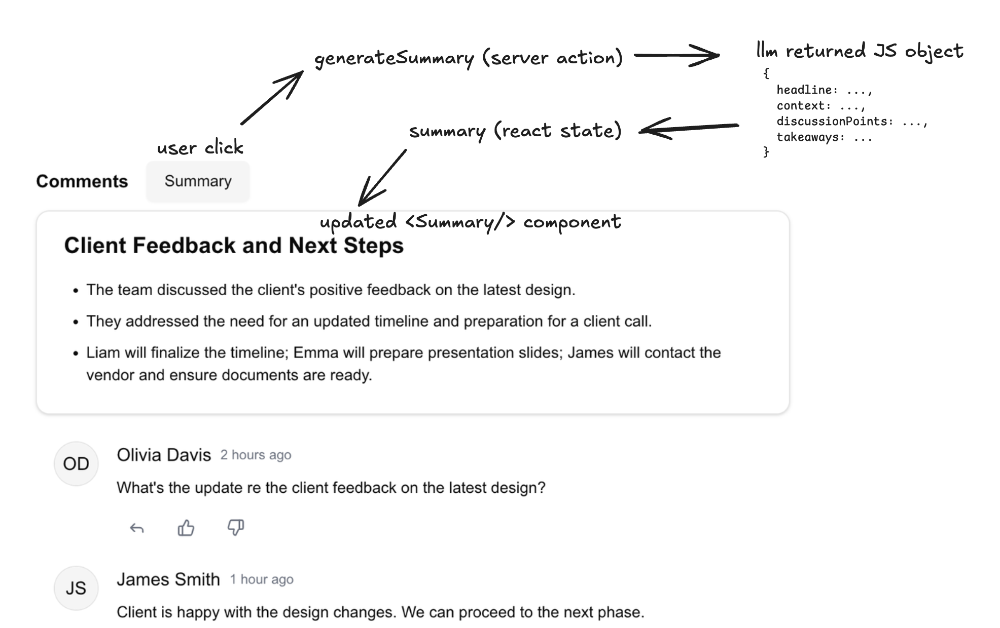
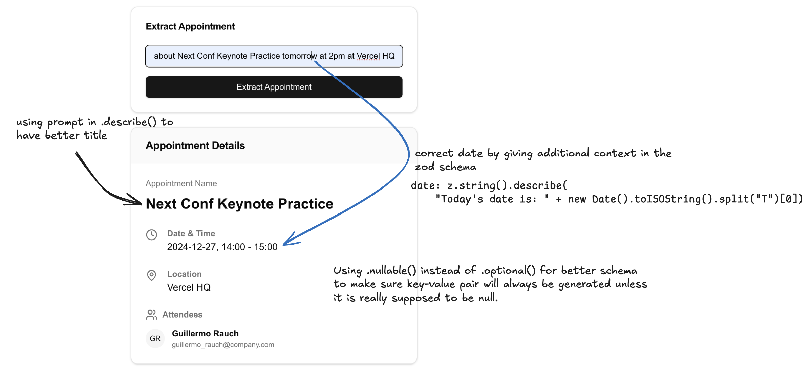

# Vercel Workshop: Building AI apps with the AI SDK and Next.js 12/5/2024

## Local development

```bash
pnpm dev
```

## Ref

Companian blog: https://build-ai-app-dec-24.vercel.app/docs

Workshop video: https://www.youtube.com/watch?v=8xZ__S9rzZU

## Learning Notes

The following are rough notes for my personal reference. The code snippets are not copy-paste-able.

### Extraction

Use `generateText` to have LLM model reply or generate contents from the given prompt.

```tsx
import { generateText } from "ai";
import { openai } from "@ai-sdk/openai";

async function main() {
  const result = await generateText({
    model: openai("gpt-4o-mini"),
    prompt: "What is the key takeaway of this piece in 50 words?" + "\n\n" + essay, 
  });
 
  console.log(result.text);
}
```

### Classification

Use `generateObject` to create json object and `zod` to force the schema of the json object.

```tsx
async function main() {
  const result = await generateObject({
    model: openai("gpt-4o-mini"),
    prompt:
      "Classify the following support requests.\n\n" +
      JSON.stringify(supportRequests),
    schema: z.object({
      request: z.string(),
      category: z.enum([
        "billing",
        "product_issues",
        "enterprise_sales",
        "account_issues",
        "product_feedback",
      ]),
      urgency: z.enum(["low", "medium", "high"]), // simply add another key to update the schema, and llm will infer it directly
      // when you are designing your schema, be careful with the model that you
      //  you are using. if you have a big schema, use bigger model, experiment.
      // smaller model will struggle to generate correct schema

      // llm is great at following example, here is an example of few-shot prompting
      language: z.string().describe("The language the support request is in. eg. English, Spanish etc."), 
    }),
    output: "array", // without this, the model will only output a single object, with this, it will array of object
  });
  console.log(result.object);
}
```

### Summarization

This is an example of using Next's Server Actions to return the llm output.

Create a `actions.ts` file, and again use `generateObject` and `zod` to have llm create a json object.

actions.ts
```ts
"use server";
 
import { generateObject } from "ai";
import { openai } from "@ai-sdk/openai";
import { z } from "zod";
 
export const generateSummary = async (comments: any[]) => {
  const result = await generateObject({
    model: openai("gpt-4o"),
    prompt: `Please summarise the following comments.
    --- 
    Comments:
    ${JSON.stringify(comments)}
`,
    schema: z.object({
      headline: z
        .string()
        // .max(5) // alternatively you can force it to have certain length
        //    but add it to .describe if you want to be more like a guideline
        .describe("The headline of the summary. Max 5 words."),
      context: z
        .string()
        .describe(
          "What is the relevant context that prompted discussion. Max 2 sentences.",
        ),
      discussionPoints: z
        .string()
        .describe("What are the key discussion points? Max 2 sentences."),
      takeaways: z
        .string()
        // llm can infer the PIC when we add "include names" in the prompt.
        // the point here is that to play around with the prompts.
        .describe(
          "What are the key takeaways / next steps? Include names. Max 2 sentences.",
        ),
    }),
  });
  return result.object;
};
```

Then in the `page.tsx` file, create a react state to get the summary from llm output.

When the user click the button, the application will call/trigger the `generateSummary` server action, and then return the generated js object with the following schema:

```json
{
  headline: ...,
  context: ...,
  discussionPoints: ...,
  takeaways: ...
}
```

Then the `summary` react state will be update to this js object and passed as props to the `<Summary/>` component.

```tsx
"use client";

import { generateSummary } from "./actions";

export default function Home() {
  // <Awaited<ReturnType<typeof generateSummary>> | null> is a nice typescript
  //    trick to get whatever the returned type from that object.
  // this is very helpful because now we don't have to update the type of
  //    summary each time we changed the schema of generateSummary
  const [summary, setSummary] = useState<Awaited<
    ReturnType<typeof generateSummary>
  > | null>(null); 
  const [loading, setLoading] = useState(false);
  return (
    <main>
      // ...
      <Button
        variant={"secondary"}
        disabled={loading}
        onClick={async () => {
          setLoading(true);
          // generate summary
          setSummary(await generateSummary(messages)); 
          setLoading(false);
        }}
      >
        Summary
      </Button>
      // ...
      {summary && <SummaryCard {...summary} />}
      // ...
    </main>
  );
}
```




### Structured Extraction

This is an example we we want to llm model to extract info from user's given input and generate the object to be displayed.

Similar to Summarization example, we will be using `generateObject`, `zod` and server action. The important piece of this example is to show how to use `zod` to generate an object with better schema using `.describe()` and `.nullable()`. This example also shows how can we provide the model with additonal context that it might not have directly in the zod schema e.g., the current date/time.

```tsx
// actions.ts
"use server";
 
import { generateObject } from "ai";
import { openai } from "@ai-sdk/openai";
import { z } from "zod";
 
export const extractAppointment = async (input: string) => {
  const result = await generateObject({
    model: openai("gpt-4o-mini"),
    prompt: "Extract appointment info for the following input: " + input,
    schema: z.object({ 
      //  tips: use .nullable() instead of optional. 
      //    if you use optional, the model sometimes skips it even though the
      //    info is there. by using nullable(), the model has to make 
      //    definite decision whether the property should be null or null.
      //    therefore it will always generate the value if the value exist
      //    else, set the value to null.
      //  this will lead to better schema generated.
      title: z.string().describe("The title of the event. This should be the main purpose of the event. No need to mention names. Clean up formatting (capitalise)."), 
      startTime: z.string().nullable().describe("format HH:MM"), 
      endTime: z.string().nullable().describe("format HH:MM - note: default meeting duration is 1 hour"), 
      attendees: z.array(z.string()).nullable().describe("comma separated list of attendees"), 
      location: z.string().nullable(),
      //  llm has no context on what is today's date, this is how to solve the 
      //    date issue.
      date: z.string().describe("Today's date is: " + new Date().toISOString().split("T")[0]), 
      // tips: spending some time on the describe() function is so so beneficial
    }), 
  });
  return result.object;
};
```



### Chatbot + Tool calling + Generative UI

To build a chatbot like application and have the model streamed an output, we will need to use Next.js server routes instead of server actions. Server action is a serverless function without a way to abort the stream. Next's server route is essentially a server's API endpoints.

There are few things in this example. 

1. Using Next server route instead of Next server action. Create `/api/chat/route.ts` for the API POST request.
2. Using `streamText()` to return the llm output instead of `generateText()` or `generateObject()`. This allows llm model to streams the output to the frontend for better user experience in coversational application. Return the llm output using `result.toDataStreamResponse()` instead of `result.object()`.

```tsx
// ./app/api/chat/route.ts

import { openai } from '@ai-sdk/openai';
import { streamText, tool } from 'ai';
import { z } from 'zod';
 
// Allow streaming responses up to 30 seconds
//    the reason we want to increase to 30s is because llm sometimes took
//    few seconds before they actually start streaming the output, so
//    10s default might no be enough.
export const maxDuration = 30;
 
export async function POST(req: Request) {
  const { messages } = await req.json();
 
  const result = streamText({
    model: openai('gpt-4o'),
    messages,
    ...
  });
  
  return result.toDataStreamResponse(); 
}

```

3. Using `useChat()` from Vercel's AI SDK UI to easily create conversational UI interface.

```tsx
// page.tsx
'use client';
 
import { useChat } from 'ai/react';
 
export default function Chat() {
  const { messages, input, handleInputChange, handleSubmit } = useChat({
    id: "weather", // for generative UI
    maxSteps: 5,   // multi-steps for tool calling
  }); 
  
  return (
    <div className="flex flex-col w-full max-w-md py-24 mx-auto stretch">
      {messages.map(m => (
        <div key={m.id}>
          ...
        </div>
      ))}
 
      <form onSubmit={handleSubmit}>
        <input
          value={input} 
          onChange={handleInputChange} />
      </form>
    </div>
  );
}
```

4. This is how to add a tool calling feature in the next's server side

```ts
  const result = streamText({
    model: openai('gpt-4o'),
    // you add a system prompt here
    system: `You are a bot to answer questions about weather.`, 
    messages,
    tools: { 
      //  make sure to name the toolName is a consise and descriptive way
      getWeather: tool({
        description: "Get the current weather at a location",
        parameters: z.object({ 
          latitude: z.number(), 
          longitude: z.number(), 
          city: z.string(), 
        }),
        execute: async ({ latitude, longitude, city }) => { 
          const response = await fetch( 
            `https://api.open-meteo.com/v1/forecast?latitude=${latitude}&longitude=${longitude}&current=temperature_2m,weathercode,relativehumidity_2m&timezone=auto`, 
          ); 
 
          const weatherData = await response.json(); 
          return { 
            temperature: weatherData.current.temperature_2m, 
            weatherCode: weatherData.current.weathercode, 
            humidity: weatherData.current.relativehumidity_2m, 
            city, 
          }; 
        }, 
      }), 
    }, 
  });
  ```

  5. We don't want the model to return only the object, we want the model to reused the data/info from the tools and provide a conversational response. For this, we need to increase the maxSteps.

 ```tsx
   const { messages, input, handleInputChange, handleSubmit } = useChat({
    //  default maxSteps is 1. So when you ask the weather, it will give you
    //    only the json object response from the tool. we don't want that
    //  to solve this, increase the maxSteps. So when you ask the weather,
    //    it will invoke the tool, get output from the tool and return it back
    //    to the llm model. Now the model have data on the weather and can
    //    answer your question correctly. maxSteps is the amount of times
    //    llm will execute the steps before returning the final result to you.
    //  now you can hide the json output from the tool, and just response
    //    with the final message.
    maxSteps: 5,   // multi-steps for tool calling
  }); 
``` 

6. We can utilize the returned json object from the model to generate a react UI component.

```tsx
{messages.map(m => (
  <div key={m.id} className="whitespace-pre-wrap">
    {m.role === 'user' ? 'User: ' : 'AI: '}
    {/* if tool has been invoked, return output from tool, else normal response */}
    {m.toolInvocations ? ( 
      m.toolInvocations.map((t) =>
        t.toolName === "getWeather" && t.state === "result" ? (
          // passing the result as props to the the <Weather/> component if the tool was invoked
          // note: the toolCallId is for the next step to allow user to interact with the UI
          <Weather key={t.toolCallId} weatherData={t.result} />
        ) : null, 
      ) 
    ) : ( 
      <p>{m.content}</p>
    )}
  </div>
))}
```

7. Finally, since the generated UI is a react component, we can allow user to interact with it. In this example, user can click button to generate another weather component for weather in a random location (by recalling the same tool). For this, we will need to specify the `id` in the `useChat` hook. We can add the `useChat()` hook in any react component to allow use to call the tool.

```tsx
// ../chat/page.tsx
'use client';
 
import { useChat } from 'ai/react';
 
export default function Chat() {
  const { messages, input, handleInputChange, handleSubmit } = useChat({
    //  to allow user to call this tool from any react component
    id: "weather",
    maxSteps: 5,
  }); 
  return (
    <div>...</div>
  );
}
```

```tsx
// ../chat/weather.tsx
// using the useChat hook in this react component
import { useChat } from "ai/react"; 

export default function Weather() {
  // specifying the id for the tool
  const { append } = useChat({ id: "weather" }); 

  return (
    <div>... </div>
  );
}
```

Final code in the `./app/(5-chatbot)`.